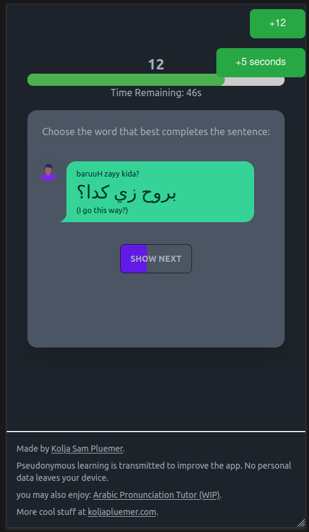

# Basic Arabic Sentences Tutor

Explore Arabic (MSA) with real corpus sentences and concordances. 




At this stage, it's maybe...a proof of concept? [Check it out here](https://arabic-concordances.koljapluemer.com/).

## User Stories

- [x] As a learner, I want to practice Arabic reading comprehension and vocabulary.

*Only sort of fulfilled. The core loop is to boring.*

## About


## Running / Contributing / Experimenting

This a very simple Vue3 app. From `App.vue`, there is a router view pointing to `components/Game.vue`, where all the logic happens. Data is represented in various json files. To run it locally, clone the repository, make sure that you have everything installed to use Vue and run the following commands in the repository's directory:

```
npm i
npm run dev
```

If you have any questions, problems or bugs to report, kindly open an issue. Cheerz!