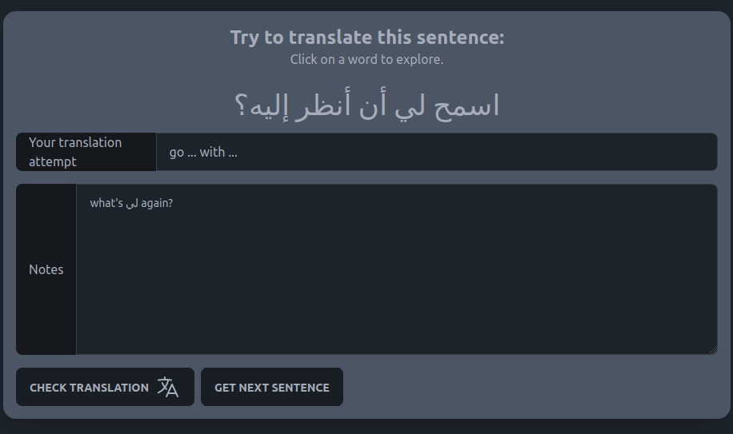

# Basic Arabic Sentences Tutor

Explore Arabic (MSA) with concordances.



## User Stories

- [] As a learner, I want to practice Arabic reading.

## About


## Running / Contributing / Experimenting

This a very simple Vue3 app, consisting of a single `App.vue` file, mostly. To run it locally, clone the repository, make sure that you have everything installed to use Vue and run the following commands in the repository's directory:

```
npm i
npm run dev
```

If you have any questions, problems or bugs to report, kindly open an issue. Cheerz!